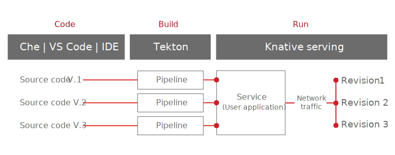
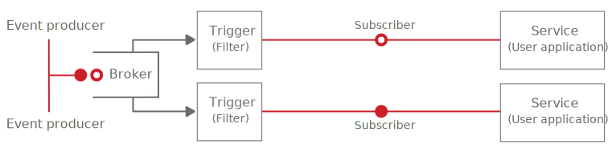
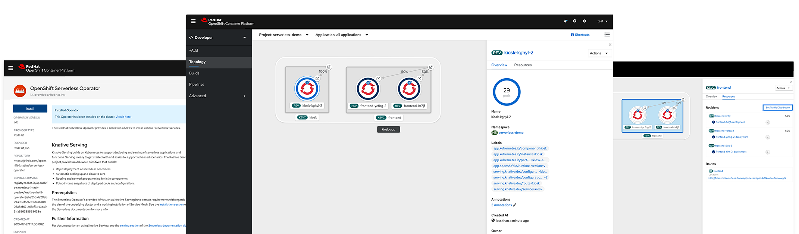

# Introduction

## What is Serverless?

Serverless is a model that allows you to build and run applications so when an event-trigger occurs, the application will automatically scale up based on incoming demand, or scale to zero after use.

Developers don’t need to worry about server provisioning or maintenance of the underlying infrastructure. They simply write their code and package it in a container for deployment.

Serverless helps organizations innovate faster because the application is abstracted from the underlying infrastructure; it can run anywhere.

## What is Knative?

Knative \(pronounced “Kay - Native”\) extends Kubernetes to provide a set of components for deploying, running and managing modern applications using the serverless methodology.  Using Knative means your serverless applications can be deployed and run on any Kubernetes platform, limiting your potential for vendor lock-in.

Knative is maintained by the open source community, including companies like Red Hat, Google, IBM and SAP, along with a great ecosystem of startups.

|  Serving |  Eventing |
| :--- | :--- |
| Offers a request-driven model that serves containerized workloads that auto-scale based on demand and that can "scale to zero." | Common infrastructure for consuming and producing events to stimulate applications. |

## What is OpenShift Serverless?

OpenShift Serverless helps developers to deploy and run event-driven applications that will start based on an event trigger, scale up resources as needed \(or to a pre-configured limit\), then scale to zero after resource burst.

In the OpenShift Serverless model, applications are packaged as Open Container Initiative \(OCI compliant Linux containers that can be run anywhere, regardless of how they are written. Your code can be packaged with runtimes in a container, and it can take advantage of being event-driven and scale to zero resource consumption when not in use.

Applications can be triggered by a variety of event sources, such as events from your own applications, cloud services from multiple providers, Software as a Service \(SaaS\) systems and Red Hat Services \([AMQ Streams](https://www.redhat.com/en/technologies/jboss-middleware/amq)\).

OpenShift Serverless applications can also be integrated with other OpenShift services, such as OpenShift [Pipelines](https://www.openshift.com/learn/topics/pipelines?hsLang=en-us), [Service Mesh](https://www.openshift.com/learn/topics/service-mesh?hsLang=en-us), Monitoring and [Metering](https://github.com/operator-framework/operator-metering), delivering a complete serverless application development and deployment experience.

## The path to Serverless

After code has been written and any required runtimes have been identified, developers can package their code and runtimes as a standard container. The difference is in how Kubernetes is instructed to launch the container so that it functions as a serverless application.

Red Hat OpenShift makes it easy for you to take advantage of delivering serverless applications. Through the CLI or through the GUI, simply instruct OpenShift that the container should run as a serverless application. That’s it. You’ve now unlocked the capabilities of Knative.

## OpenShift Serverless Benefits

| Run anywhere | Integrate with legacy | Focus on business | Operations friendly |
| :--- | :--- | :--- | :--- |
| Use Kubernetes and Red Hat OpenShift to build, scale, and manage serverless applications in any cloud, on-premise, or in a hybrid environment. | Build modern, serverless applications and support legacy applications through event sources. Manage both types of applications on Red Hat OpenShift. | With little or no infrastructure to set up, Knative allows developers to focus on building new products. Knative installs on OpenShift using Operators, simplifying installation and automating updates and management for Day 2 operations. | Knative uses Kubernetes to help gain greater consistency and incremental scalability across applications and teams. |

## References

[https://www.openshift.com/learn/topics/serverless](https://www.openshift.com/learn/topics/serverless)

