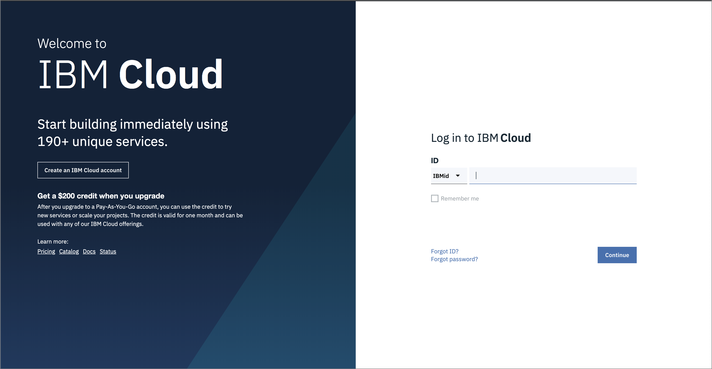

# Pre-work

This section is broken up into the following steps:

1. [Sign up for IBM Cloud](https://ibm.biz/trmeetup74)
2. Provision your OpenShift environment

## 1. Sign up for IBM Cloud

Ensure you have an IBM Cloud ID

## 2. Provision your OpenShift Environment

1. Go to [IBM Developer Open Labs](https://developer.ibm.com/openlabs/openshift). 
2. Press "Launch Lab" button on Lab2.   
3. Click Exercise 1
4. To open Web Console:  Click "**here**" link in `"If you don't have the OpenShift web console open, you can open it by clicking here."` text.

